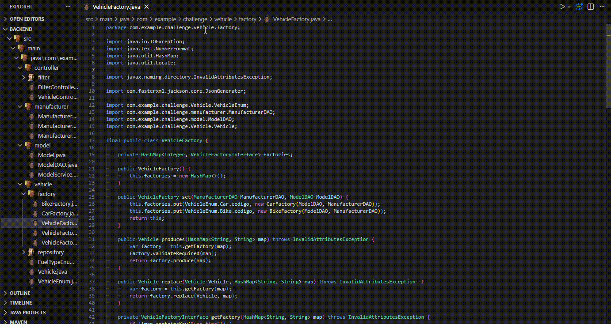

## UML Diagram Class Generator

The **UML Diagram Class Generator** extension 

The extension can generate a UML Class Diagram from a source code. Accepts Java and PHP projects (new languages soon).

To generate a class diagram, just `right-click` on tab with title of file and `Create UML Class Diagram`. Alternatily, try `Ctrl + Shift + P` and `UML Gen`.

---
- you can move a box to best view class diagram;
- allows expand/hide attributes and methods;
- `ctrl + click` on box will open a class diagram;

#### Demo

